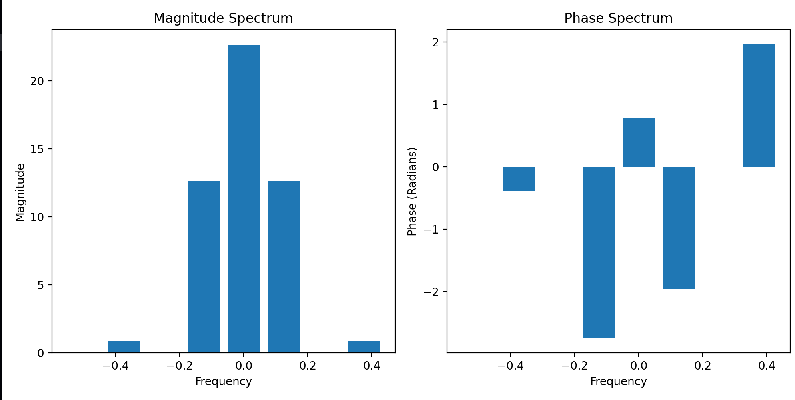

# HorseRiders 🏇🏇🏇
### Fast Fourier Transformation Implementation and a Complex Maths Library written in Huff

HorseRiders is a complex math library implemenation written in huff. It includes 

1. Fast Fourier Transform
2. Complex Numbers Math Library
3. Implementation of PRBMath in huff

Fast Fourier Transform is an algorithm to calcualte the discrete fourier transform of a given set of inputs. It computes the output in O(nlogn) time complexity instead of n^2 which is the case with DFT.

In this Library you can find the following functions : 

```s
addZ --> Addition Operation
subZ --> Subtraction Operation
mulZ --> Multiplication Operation
divZ --> Division Operation
calcR --> Amplitude of a complex number
toPolar --> convert cartisian into Polar 
fromPolar --> Convert Polar to cartesian
p_atan2 --> Calculate arctan(x/y)
atan1to1 --> calculate arctan(x/y) in a gas efficient way in the range of -1 to 1
ln --> calculate natural logarithm 
sqrt --> calculate sqrt of complex number
expZ --> calculate exponential of complex number
pow --> calculate complex number raised to some power
```

## Example

Let us the take the following sample points

```cpp
cd(0, 0), cd(1, 1), cd(3, 3), cd(4, 4), cd(4, 4), cd(3, 3), cd(1, 1), cd(0, 0)
```

For these points the following output is observed whcih represents the amplitude of the corresponding frequency buckets. 

```
(16,16) (-4.82843,-11.6569) (0,0) (-0.343146,0.828427) (0,0) (0.828427,-0.343146) (0,0) (-11.6569,-4.82843)
```

which is the correct output as seen in this matplotlib plot as shown here 

</img>

and the result is shown here 

```
[ 16.        +16.j          -4.82842712-11.65685425j
   0.         +0.j          -0.34314575 +0.82842712j
   0.         +0.j           0.82842712 -0.34314575j
   0.         +0.j         -11.65685425 -4.82842712j]
[ 0.     0.125  0.25   0.375 -0.5   -0.375 -0.25  -0.125]
```

which is the correct result !

Here is its implementation by one of our team members --> https://github.com/0xpanicError/solidityFFT

### Credits

This Project was made by three University Students

1. Yash Saraswat | [panic](https://www.twitter.com/0xpanicError)
2. Shourya Goel | [shogo](https://twitter.com/ShogLoFi)
3. Prabhat Verma | [PROBOT](https://twitter.com/pr0b0t1sc00l)
